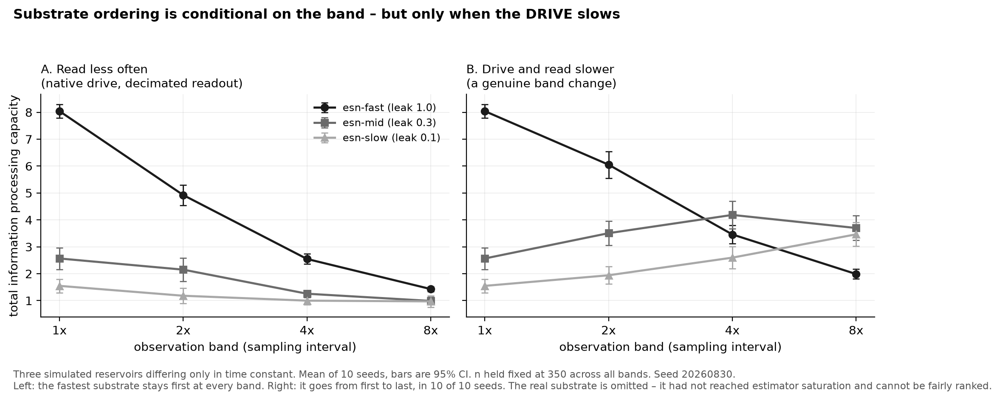

[](LICENSE)
[](LICENSE-data)


# Does the observation band change which substrate computes better?

A small, fully reproducible experiment on reservoir-computing benchmarks.

**Short answer: yes, but only when the *drive* slows — not when you merely read less often.**
Those two are routinely conflated, and they give opposite answers about ordering.

---

## The question

Physical reservoir computing compares substrates by measuring how much of a driven input each one
converts into separable state — Information Processing Capacity (IPC). Everyone in the field knows
capacity depends on how the substrate's time constant matches the input's timescale. Almost every
published comparison nonetheless reports a single number per substrate, at a single band.

So: **is the ordering of substrates conditional on the band?** And a second question that matters for
anyone re-analysing published recordings: **can you answer the first question by decimating an
archived recording?**

## Design

Three leaky echo-state networks, identical in size (60 nodes), topology, spectral radius (.95), and
seed — **differing only in leak rate**, which is the time constant. Plus one real physical substrate,
an INRiM self-organising nanowire network, included for the estimator control only.

Two arms, because they are not the same experiment:

| Arm | What changes | Available for |
|---|---|---|
| **A — read less often** | Native drive, readout decimated by *k* | Simulated **and** archived recordings |
| **B — drive and read slower** | Input held for *k* steps, then read | Simulated only — you cannot re-drive a recording |

Ten independent seeds per substrate, each drawing a fresh reservoir *and* a fresh input.
95% confidence intervals are t-based, df = 9.

**Two controls that are load-bearing, not decoration:**

- **`n` is held fixed at 350 across every band.** IPC is strongly biased by sample count. A naive
  decimation sweep drops *n* alongside the band and reports estimator starvation as a band effect —
  and because both push the same way, it produces the expected answer for the wrong reason.
- **A saturation curve is published** (`output/saturation_rows.csv`) so the bias being controlled for
  is visible.

## Results



**Arm A — reading less often costs capacity and reorders nothing.** The fastest substrate is first at
every band, in every seed.

**Arm B — slowing the drive inverts the ordering.**

| Arm B, mean [95% CI] | k=1 | k=2 | k=4 | k=8 |
|---|---|---|---|---|
| esn-fast (leak 1.0) | **8.04** [7.79, 8.29] | **6.05** [5.55, 6.55] | 3.46 [3.11, 3.80] | 1.99 [1.81, 2.17] |
| esn-mid (leak 0.3) | 2.57 [2.16, 2.97] | 3.51 [3.05, 3.96] | **4.18** [3.67, 4.70] | **3.70** [3.24, 4.16] |
| esn-slow (leak 0.1) | 1.55 [1.29, 1.80] | 1.94 [1.62, 2.26] | 2.60 [2.19, 3.00] | 3.46 [3.03, 3.90] |

The fastest substrate goes from first to last. Fast-minus-mid is **+5.47 [+4.97, +5.98]** at k=1 and
**−1.71 [−2.07, −1.35]** at k=8 — opposite signs, both excluding zero — and the per-seed inversion
holds in **10 of 10 seeds**.

### What follows

1. **Published substrate comparisons are band-conditional**, and the band is usually not reported.
   A comparison at one band is a statement about those substrates *at that band*.
2. **Decimating an archived recording is not a proxy for a band change.** It answers a different
   question and gives the opposite answer about ordering. The band question needs control of the
   drive, which means an instrument, not a data repository.
3. **Holding *n* fixed is necessary but not sufficient.** The three simulated substrates saturate by
   n=350; the real one does not saturate until past n=1400, so it is estimator-starved at the
   study's *n* and is **excluded from every ordering claim and omitted from the figure**. A fair
   comparison needs *n* above every substrate's saturation point, which recording length then caps.

## Limits

Stated here rather than left for a reader to find:

- **Three simulated substrates from one architecture family.** This is not a survey of materials and
  says nothing about arrangement across matter.
- **The one real substrate could not be fairly ranked** and appears only in the saturation control.
- **Arm B slows the drive by zero-order hold.** Standard and physical, but one choice among several.
- **One estimator, one basis, `max_delay` 8, `max_degree` 2.** The delay horizon is itself a band
  parameter, held fixed here.
- **Ten seeds, t-based intervals, no multiplicity correction.** A fixed-effects statement about these
  three reservoirs, not a population claim about architectures.
- **Nothing here is evidence about cognition, intelligence, or minds.** It is a measurement about
  benchmarking practice.

## Credits

IPC estimation uses [RCbench](https://github.com/nanotechdave/RCbench) (MIT), and the real recording
is one of its test fixtures — a self-organising nanowire network measured at INRiM. The capacity
measure is Dambre, Verstraeten, Schrauwen & Massar, *Information Processing Capacity of Dynamical
Systems*, Scientific Reports 2:514 (2012), [doi:10.1038/srep00514](https://doi.org/10.1038/srep00514).
The band-sweep-on-one-substrate design follows Ishida, Shiramatsu, Kubota, Akita & Takahashi,
Applied Physics Letters 122:233702 (2023), [doi:10.1063/5.0152585](https://doi.org/10.1063/5.0152585).

## 1 | Getting Started

This repository is the self-contained artifact for the experiment above: the study code,
the committed per-seed results, the figure, and a one-command pipeline. Clone it and run
`./reproduce.sh` to recompute every number in this README from scratch. Nothing is
withheld and there are no API keys — the one real recording is fetched from a public
source on first run.

## 2 | Project Layout

```
code/band_ordering_study.py   the experiment: both arms, 10 seeds, saturation control
code/make_figure.py           renders output/figures/band_ordering.png from the CSVs
output/band_ordering_rows.csv one row per (substrate, arm, band, seed)
output/saturation_rows.csv    the estimator control: capacity against sample count
output/figures/               the figure
reproduce.sh                  one-command pipeline
```

## 3 | Quick Start

```
./reproduce.sh              # full study, then the figure
./reproduce.sh --check-only # verify dependencies only, run nothing
```

or run the two steps directly:

```
uv run --script code/band_ordering_study.py
uv run --script code/make_figure.py
```

Deterministic: seed 20260830, and a second run was verified byte-identical to the
first. Runtime is roughly 40 minutes on a laptop.

## 4 | Dependencies

[`uv`](https://docs.astral.sh/uv/) is the only prerequisite. Both scripts carry inline
PEP 723 dependency metadata, so `uv run --script` resolves numpy, scipy, scikit-learn,
pandas, matplotlib and `rcbench` on first run with no environment setup.

## 5 | Script Map

| Script | Does |
|---|---|
| `code/band_ordering_study.py` | Loads the real recording, builds the three simulated reservoirs, runs Arm A and Arm B across four bands for 10 seeds, runs the saturation control, writes both CSVs, and prints the tables and the per-seed inversion test |
| `code/make_figure.py` | Reads `output/band_ordering_rows.csv`, aggregates to means with 95% intervals, and writes the two-panel figure |

## 6 | Citation

Citation metadata is in [CITATION.cff](CITATION.cff). If you use the code or data,
please cite this repository.

## 7 | Licence

Code MIT ([LICENSE](LICENSE)). Data and figures CC BY 4.0 ([LICENSE-data](LICENSE-data)).

*Last updated: 2026-08-30*
