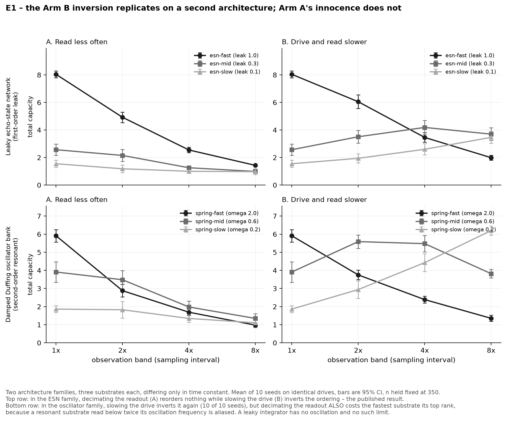
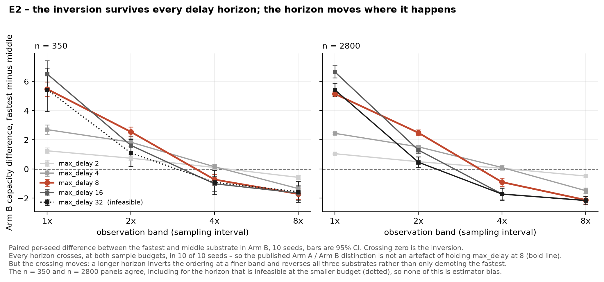

[](LICENSE)
[](LICENSE-data)


# Does the observation band change which substrate computes better?

A small, fully reproducible experiment on reservoir-computing benchmarks.

**Short answer: yes, but only when the *drive* slows — not when you merely read less often.**
Those two are routinely conflated, and they give opposite answers about ordering.

---

## The question

Physical reservoir computing compares substrates by measuring how much of a driven input each one
converts into separable state — Information Processing Capacity (IPC). Everyone in the field knows
capacity depends on how the substrate's time constant matches the input's timescale. Almost every
published comparison nonetheless reports a single number per substrate, at a single band.

So: **is the ordering of substrates conditional on the band?** And a second question that matters for
anyone re-analysing published recordings: **can you answer the first question by decimating an
archived recording?**

## Design

Three leaky echo-state networks, identical in size (60 nodes), topology, spectral radius (.95), and
seed — **differing only in leak rate**, which is the time constant. Plus one real physical substrate,
an INRiM self-organising nanowire network, included for the estimator control only.

Two arms, because they are not the same experiment:

| Arm | What changes | Available for |
|---|---|---|
| **A — read less often** | Native drive, readout decimated by *k* | Simulated **and** archived recordings |
| **B — drive and read slower** | Input held for *k* steps, then read | Simulated only — you cannot re-drive a recording |

Ten independent seeds per substrate, each drawing a fresh reservoir *and* a fresh input.
95% confidence intervals are t-based, df = 9.

**Two controls that are load-bearing, not decoration:**

- **`n` is held fixed at 350 across every band.** IPC is strongly biased by sample count. A naive
  decimation sweep drops *n* alongside the band and reports estimator starvation as a band effect —
  and because both push the same way, it produces the expected answer for the wrong reason.
- **A saturation curve is published** (`output/saturation_rows.csv`) so the bias being controlled for
  is visible.

## Results


**Arm A — reading less often costs capacity and reorders nothing.** The fastest substrate is first at
every band, in every seed. **This holds for echo-state networks and does not generalise:** on a
resonant substrate the readout interval alone reorders. See *Extension E1* below, which was run
after first publication and narrows this claim.

**Arm B — slowing the drive inverts the ordering.**

| Arm B, mean [95% CI] | k=1 | k=2 | k=4 | k=8 |
|---|---|---|---|---|
| esn-fast (leak 1.0) | **8.04** [7.79, 8.29] | **6.05** [5.55, 6.55] | 3.46 [3.11, 3.80] | 1.99 [1.81, 2.17] |
| esn-mid (leak 0.3) | 2.57 [2.16, 2.97] | 3.51 [3.05, 3.96] | **4.18** [3.67, 4.70] | **3.70** [3.24, 4.16] |
| esn-slow (leak 0.1) | 1.55 [1.29, 1.80] | 1.94 [1.62, 2.26] | 2.60 [2.19, 3.00] | 3.46 [3.03, 3.90] |

The fastest substrate goes from first to last. Fast-minus-mid is **+5.47 [+4.97, +5.98]** at k=1 and
**−1.71 [−2.07, −1.35]** at k=8 — opposite signs, both excluding zero — and the per-seed inversion
holds in **10 of 10 seeds**.

### What follows

1. **Published substrate comparisons are band-conditional**, and the band is usually not reported.
   A comparison at one band is a statement about those substrates *at that band*.
2. **Decimating an archived recording is not a proxy for a band change.** It answers a different
   question and gives the opposite answer about ordering. The band question needs control of the
   drive, which means an instrument, not a data repository. *Extension E1 strengthens this rather
   than softening it: on a resonant substrate a decimated recording can reorder substrates through
   aliasing alone, for a reason that is not about the band at all.*
3. **Holding *n* fixed is necessary but not sufficient.** The three simulated substrates saturate by
   n=350; the real one does not saturate until past n=1400, so it is estimator-starved at the
   study's *n* and is **excluded from every ordering claim and omitted from the figure**. A fair
   comparison needs *n* above every substrate's saturation point, which recording length then caps.

## Extension E1 — does this replicate on a second architecture?

Everything above rests on leaky echo-state networks. If the inversion were a property of *leaky
integrators* rather than of substrates generally, the result would be far narrower than it reads. So
the same two arms, the same band grid and the same n-fixed discipline were run on a mechanically
different family: **a bank of coupled damped Duffing oscillators** — second-order resonant dynamics,
where the time constant is an envelope decay 1/(ζω) set by a natural frequency rather than by a leak,
and where the substrate has an oscillation period that a leaky integrator does not have.

The three oscillator substrates differ only in ω, exactly as the three ESNs differ only in leak.
Their time constants (1.67, 5.56, 16.67 drive steps) were placed to span the ESN family's (1.0, 2.8,
9.5) so the band grid straddles them in both families. Calibration targeted time-constant span and
numerical stability, never an ordering. Both families see identical drives, seed for seed.



**The Arm B inversion replicates, and more completely.**

| Oscillator family, Arm B, mean [95% CI] | k=1 | k=2 | k=4 | k=8 |
|---|---|---|---|---|
| spring-fast (ω 2.0) | **5.91** [5.57, 6.25] | 3.75 [3.49, 4.01] | 2.39 [2.20, 2.57] | 1.35 [1.18, 1.52] |
| spring-mid (ω 0.6) | 3.91 [3.35, 4.47] | **5.59** [5.22, 5.96] | **5.48** [5.03, 5.93] | 3.82 [3.58, 4.05] |
| spring-slow (ω 0.2) | 1.86 [1.67, 2.05] | 2.94 [2.45, 3.43] | 4.43 [3.94, 4.92] | **6.20** [5.95, 6.45] |

Ordering at k=1 is fast > mid > slow; at k=8 it is slow > mid > fast — a complete reversal of all
three, deeper than the ESN's. The full reversal holds in **10 of 10 seeds**. Paired fast-minus-mid is
**+2.00 [+1.20, +2.80]** at k=1 and **−2.46 [−2.73, −2.20]** at k=8.

**The Arm A result does not replicate, and that is what E1 was worth running for.**

| Oscillator family, Arm A, mean [95% CI] | k=1 | k=2 | k=4 | k=8 |
|---|---|---|---|---|
| spring-fast (ω 2.0) | **5.91** [5.57, 6.25] | 2.88 [2.53, 3.23] | 1.69 [1.51, 1.87] | 0.98 [0.88, 1.07] |
| spring-mid (ω 0.6) | 3.91 [3.35, 4.47] | **3.48** [2.97, 4.00] | **1.98** [1.65, 2.31] | **1.35** [1.09, 1.60] |
| spring-slow (ω 0.2) | 1.86 [1.67, 2.05] | 1.82 [1.37, 2.28] | 1.35 [1.13, 1.56] | 1.10 [0.84, 1.37] |

The top rank passes from spring-fast to spring-mid at k=2 and never returns. Paired fast-minus-mid at
k=8 is **−0.37 [−0.65, −0.09]**, with only 1 of 10 seeds still positive, against the ESN's
**+0.44 [+0.30, +0.58]** and 10 of 10.

**Reported at its real size, which is smaller than the Arm B effect.** Fast-minus-slow at k=8 is
**−0.13 [−0.41, +0.15]**, 4 of 10 seeds positive — that comparison is unresolved. The full reversal
holds in 5 of 10 seeds, not 10. So decimating the readout **costs the fastest substrate its top rank;
it does not cleanly send it to last.** Arm B does both, in both families.

**The mechanism is aliasing, and it is checkable rather than asserted.** Samples per oscillation
period, which only a resonant substrate has:

| | period | k=1 | k=2 | k=4 | k=8 |
|---|---|---|---|---|---|
| spring-fast (ω 2.0) | 3.14 | 3.14 | **1.57** | 0.79 | 0.39 |
| spring-mid (ω 0.6) | 10.47 | 10.47 | 5.24 | 2.62 | **1.31** |
| spring-slow (ω 0.2) | 31.42 | 31.42 | 15.71 | 7.85 | 3.93 |

Nyquist needs more than 2 samples per period; bold marks the first band below it. **The order in
which the substrates cross Nyquist is the order in which they lose rank.** A leaky integrator has no
oscillation and so no Nyquist limit of this kind — which is why Arm A looked harmless. The original
Arm A result measured the absence of a resonance, not the innocence of a readout.

**A third family was attempted and rejected on design grounds, before its result was read.** In a
delay-based reservoir of the Appeltant construction, θ/T sets both the physical time constant and the
virtual-node resolution, so reaching a time constant of τ drive steps with N virtual nodes forces
θ/T = 1/(Nτ) — far below the regime in which virtual nodes are resolved. The sign-alternating mask
then averages out across the smoothing window, the drive is attenuated, and capacity sits at 1.1–1.5
regardless of τ, N or input gain. The family cannot both span the ESN's time-constant range and
remain a working reservoir. Reproduce the table this rests on with
`uv run --script code/e1_second_architecture.py --delay-probe`.

## Extension E2 — does the verdict survive re-tuning the delay horizon?

Arm A varies the readout interval and Arm B varies the drive, but neither varies `max_delay` — the
horizon over which the capacity estimator looks for memory. It is itself a band parameter, it was
held fixed at 8, and it was never examined. So: does the whole Arm A / Arm B distinction survive
re-tuning it?

**The confound had to be handled first.** The IPC basis at degree 2 carries d + d(d+1)/2 terms, so it
grows quadratically in the horizon. Against a fixed *n*, a long horizon starves the estimator exactly
as a small *n* does — the same trap the n-fixed discipline was built for, arriving through a
different door.

| max_delay | 2 | 4 | 8 | 16 | 32 |
|---|---|---|---|---|---|
| basis terms | 5 | 14 | 44 | 152 | 560 |
| samples/term at n=350 | 70.0 | 25.0 | 7.95 | 2.30 | **0.62** |
| samples/term at n=2800 | 560 | 200 | 63.6 | 18.4 | 5.00 |

So the sweep ran at **two sample counts** — n=350, the study's own, and n=2800 — and cells below 2
samples per basis term are marked infeasible in the CSV and excluded from every verdict, the same
discipline that excluded the estimator-starved real recording.



**Both verdicts hold at every horizon, at both budgets.**

| | Arm B inversion (per-seed) | fast−mid at k=1 | fast−mid at k=8 | Arm A top rank |
|---|---|---|---|---|
| d=2, n=2800 | 10/10 | +1.05 [+1.01, +1.08] | −0.48 [−0.57, −0.40] | preserved |
| d=4, n=2800 | 10/10 | +2.44 [+2.36, +2.52] | −1.49 [−1.67, −1.30] | preserved |
| **d=8, n=2800** | **10/10** | **+5.15 [+4.99, +5.30]** | **−2.12 [−2.39, −1.86]** | **preserved** |
| d=16, n=2800 | 10/10 | +6.66 [+6.24, +7.07] | −2.16 [−2.44, −1.87] | preserved |
| d=32, n=2800 | 10/10 | +5.43 [+4.96, +5.90] | −2.16 [−2.45, −1.88] | preserved |

The n=350 panel agrees at every horizon, including at d=32 where it is infeasible and its intervals
visibly widen (+5.44 [+3.94, +6.93] against +5.43 [+4.96, +5.90] at n=2800). Agreement across a
budget that changes feasibility is what rules out estimator bias. **The Arm A / Arm B distinction is
not an artefact of holding the horizon at 8.**

**But the horizon is not inert, and this is the part worth reporting.** The crossover band moves with
it. At d=2 and d=4 the ordering holds fast > mid > slow through k=4 and flips only at k=8; at d=8 the
flip begins at k=4; at d=16 and d=32 the k=8 ordering deepens to slow > mid > fast — a complete
reversal rather than a demotion of the fastest. The effect size is non-monotone and peaks at d=16, so
**the d=8 used above was neither the most nor the least favourable choice available**, which is worth
saying plainly since it was fixed without this sweep in hand.

So a reported crossover band is a joint property of the observation band *and* the delay horizon, not
of the band alone. **A comparison that reports where an ordering flips must publish its horizon
alongside, exactly as it must publish its n.**

## Limits

Stated here rather than left for a reader to find:

- **Two architecture families (leaky ESN, damped oscillator bank) since E1.** This is not a survey of
  materials and says nothing about arrangement across matter. A delay-based reservoir was attempted
  and rejected on design grounds, described in E1.
- **The one real substrate could not be fairly ranked** and appears only in the saturation control.
- **Arm B slows the drive by zero-order hold.** Standard and physical, but one choice among several.
- **One estimator and one basis.** `max_degree` is fixed at 2 throughout and has never been varied.
  The delay horizon is no longer held fixed — E2 sweeps it from 2 to 32 at two sample budgets.
- **Ten seeds, t-based intervals, no multiplicity correction.** A fixed-effects statement about these
  reservoirs, not a population claim about architectures — two families is a replication, not a
  survey.
- **Nothing here is evidence about cognition, intelligence, or minds.** It is a measurement about
  benchmarking practice.

## Credits

IPC estimation uses [RCbench](https://github.com/nanotechdave/RCbench) (MIT), and the real recording
is one of its test fixtures — a self-organising nanowire network measured at INRiM. The capacity
measure is Dambre, Verstraeten, Schrauwen & Massar, *Information Processing Capacity of Dynamical
Systems*, Scientific Reports 2:514 (2012), [doi:10.1038/srep00514](https://doi.org/10.1038/srep00514).
The band-sweep-on-one-substrate design follows Ishida, Shiramatsu, Kubota, Akita & Takahashi,
Applied Physics Letters 122:233702 (2023), [doi:10.1063/5.0152585](https://doi.org/10.1063/5.0152585).

## 1 | Getting Started

This repository is the self-contained artifact for the experiment above: the study code,
the committed per-seed results, the figure, and a one-command pipeline. Clone it and run
`./reproduce.sh` to recompute every number in this README from scratch. Nothing is
withheld and there are no API keys — the one real recording is fetched from a public
source on first run.

## 2 | Project Layout

```
code/band_ordering_study.py     the experiment: both arms, 10 seeds, saturation control
code/make_figure.py             renders output/figures/band_ordering.png from the CSVs
code/e1_second_architecture.py  E1: the same design on a damped-oscillator family
code/make_figure_e1.py          renders output/figures/e1_architecture.png
code/e2_max_delay.py            E2: sweeps the delay horizon at two sample budgets
code/make_figure_e2.py          renders output/figures/e2_max_delay.png
output/band_ordering_rows.csv   one row per (substrate, arm, band, seed)
output/saturation_rows.csv      the estimator control: capacity against sample count
output/e1_architecture_rows.csv one row per (family, substrate, arm, band, seed)
output/e2_max_delay_rows.csv    adds max_delay, basis size and a feasibility flag
output/figures/                 the three figures
reproduce.sh                    one-command pipeline
```

## 3 | Quick Start

```
./reproduce.sh              # full study, then the figure
./reproduce.sh --check-only # verify dependencies only, run nothing
```

or run the two steps directly:

```
uv run --script code/band_ordering_study.py
uv run --script code/make_figure.py
uv run --script code/e1_second_architecture.py
uv run --script code/make_figure_e1.py
uv run --script code/e2_max_delay.py
uv run --script code/make_figure_e2.py
```

Deterministic: seed 20260830, and a second run was verified byte-identical to the
first. Runtime is roughly 40 minutes for the main study on a laptop, plus about 10
for E1 and 25 for E2.

## 4 | Dependencies

[`uv`](https://docs.astral.sh/uv/) is the only prerequisite. Both scripts carry inline
PEP 723 dependency metadata, so `uv run --script` resolves numpy, scipy, scikit-learn,
pandas, matplotlib and `rcbench` on first run with no environment setup.

## 5 | Script Map

| Script | Does |
|---|---|
| `code/band_ordering_study.py` | Loads the real recording, builds the three simulated reservoirs, runs Arm A and Arm B across four bands for 10 seeds, runs the saturation control, writes both CSVs, and prints the tables and the per-seed inversion test |
| `code/make_figure.py` | Reads `output/band_ordering_rows.csv`, aggregates to means with 95% intervals, and writes the two-panel figure |
| `code/e1_second_architecture.py` | Runs both arms across the band grid for two architecture families on identical drives, reports the per-seed inversion test and the Arm A top-rank verdict for each. `--delay-probe` reproduces the delay-reservoir rejection table instead |
| `code/make_figure_e1.py` | Reads `output/e1_architecture_rows.csv` and writes the 2x2 family-by-arm figure |
| `code/e2_max_delay.py` | Sweeps `max_delay` over 2-32 across both arms and both sample budgets, flags cells below 2 samples per basis term as infeasible, and prints the two verdicts per horizon |
| `code/make_figure_e2.py` | Reads `output/e2_max_delay_rows.csv` and writes the paired fast-minus-middle difference against band, one line per horizon |

## 6 | Citation

Citation metadata is in [CITATION.cff](CITATION.cff). If you use the code or data,
please cite this repository.

## 7 | Licence

Code MIT ([LICENSE](LICENSE)). Data and figures CC BY 4.0 ([LICENSE-data](LICENSE-data)).

*Last updated: 2026-08-30*
